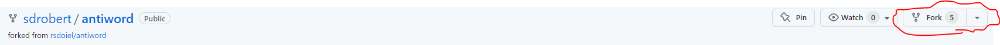
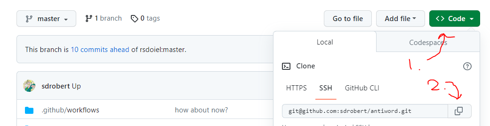

# antiword

## Fork and installation

1. Fork the [antiword](https://github.com/sdrobert/antiword) repo.
    
2. In a shell instance, navigate to the same root directory which you cloned
   kaldi-faetar into.
   ``` sh
   ls kaldi-faetar/egs/hlvc_faetar/prep
   # should print something like: cmd.sh  conf  data  environment.yaml  environment.yml  exp  local  path.sh  run.sh  steps  utils
   ```
3. Clone your new antiword repository into that root directory by copy-pasting
   the command from GitHub.
   
   This image is relative to my repo. **Make sure to copy the command from
   your fork!**


## Build environment

``` sh
conda env create -f enviroment.yaml  # creates 'antiword' conda environment
conda activate antiword
```

## Building package

``` sh
# assuming antiword is activated

# 1. Configure build (do once). Intermediate files will be stored in build/
cmake -B build -DCMAKE_INSTALL_PREFIX=$CONDA_PREFIX -DCMAKE_BUILD_TYPE=Release

# 2. Actually build. Repeat any time you make changes to the code
cmake --build build
```

## Testing package

``` sh

# Install antiword to conda environment 'antiword' (redo if new build)
cmake --install build

# antiword should be a command now
antiword -h

# Test on document (antiword only)
antiword -m ipaphon.txt /path/to/doc/file/F11B_FW.doc

# Test on document (including sanitize_doctext.pl and sanitize_text.pl)
local/doc_to_text.sh /path/to/doc/file/F11B_FW.doc

# view hex codes of characters (doc itself)
hexdump -C /path/to/doc/file/F11B_FW.doc

# view hex codes of characters (after command)
... | hexdump -C
```
